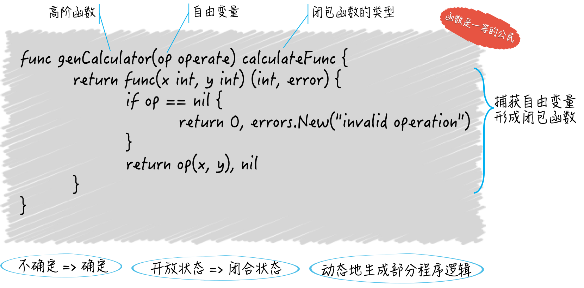

# Go的函数

[toc]

## 一、函数时一等的数据类型

函数不仅可以封装代码，还能作为独立的逻辑组件进行传播。

```go
package main

import (
	"fmt"
)

type Printer func(content string) (n int, err error)

func printToStd(contents string) (bytesNum int, err error) {
	return fmt.Println(contents)
}

func main() {
	var p Printer
	p = printToStd
	p("something")
}
```

“函数式一等公民”是函数式编程的重要特征。Go语言在语言层面支持了函数式编程。

## 二、高级函数

### 2.1 什么是高级函数

高级函数可以满足下面两个条件（满足一个或都满足）：

- 接受其他的函数作为参数传入；

- 把其他的函数作为结果返回；

#### （1）高级函数示例一：接受其他的函数作为参数传入

```go
package main

import (
	"errors"
	"fmt"
)

type operate func(a, b int) int

func calculate(x int, y int, op operate) (int, error) {
	if op == nil {
		return 0, errors.New("无效的操作")
	}
	return op(x, y), nil
}

func main() {
	op := func(a, b int) int {
		return a + b
	}

	x, y := 2, 1
	res, err := calculate(x, y, op)
	if err == nil {
		fmt.Println(res)
	} else {
		fmt.Println(err)
	}

}
```

#### （2）高级函数示例二：体现两个特性

```go
package main

import (
	"errors"
	"fmt"
)

type calculateFunc func(x, y int) (int, error)

type operate func(x, y int) int

func genCalculate(op operate) calculateFunc {
	return func(x, y int) (int, error) {
		if op == nil {
			return 0, errors.New("无效的操作")
		}
		return op(x, y), nil
	}
}

func main() {
	x, y := 58, 59
	op := func(x, y int) int {
		return x + y
	}
	add := genCalculate(op)

	res, err := add(x, y)
	fmt.Printf("结果为：%d （error：%v）\n", res, err)
}
```

### 2.2 如何实现闭包

#### （1）闭包是什么

在一个函数中存在对**外来标识符**的引用。

> 这个外来标识符，既不代表当前函数的任何参数或结果，也不是函数内部声明的，它是直接从外边拿过来的。

对这个**外来标识符**，有个专门的术语称呼它，叫**自由变量**。而闭包体现的是有由“不确定”变为“确定”的一个过程。

> 自由变量，肯定是一个变量，如果是常量就形成不了闭包。因为常量是不可变的程序实体。

闭包函数因为引用来自由变量，而呈现出一种**“不确定”的状态，也叫“开放”状态**。

> 也就是说，它的内部逻辑并不完整，有一部分逻辑需要这个自由变量参与完成，而自由变量到底代表了什么，在闭包函数在定义的时候却是未知的。
>
> 对于像Go这样的静态类型的编程语言，我们在定义闭包函数的时候最多也只能知道自由变量的类型。

在上面的`genCalculate`函数内部，实际上就实现了一个闭包，而`genCalculate` 函数也是一个高级函数。

```go
func genCalculate(op operate) calculateFunc {
	return func(x, y int) (int, error) {
		if op == nil {
			return 0, errors.New("无效的操作")
		}
		return op(x, y), nil
	}
}
```

当程序运行到 `if op==nil` 这一行到时候，Go会试图去寻找op所代表的东西。如此一来，这个函数就由“不确定”变为“确定”，或者说转为“闭合”状态了。至此也就真正形成了闭包。

上面我们用高阶函数实现闭包，这也是高阶函数的一大功能。



#### （2）闭包的作用

动态的生成程序逻辑。

### 2.3  函数的参数

#### （1）数组是值类型

```go
package main

import "fmt"

// 在函数中修改的只是原数组的副本，并不会对原数组造成任何影响
func modifyArray(a [3]string) [3]string {
	a[1] = "x"
	return a
}

func main() {
	array1 := [3]string{"a", "b", "c"}
	fmt.Printf("数组：%v\n", array1) // 数组：[a b c]
	array2 := modifyArray(array1)
	fmt.Printf("修改后：%v\n", array2) // 修改后：[a x c]
	fmt.Printf("原始值：%v\n", array1) //  原始值：[a b c]
}
```

所有传给函数的参数值都会被复制，函数在其内部使用的并不是参数值的原值，而是它的副本。

数组是值类型，所以每一次复制都会拷贝它，以及它的元素值。

#### （2）引用类型

对于引用类型，比如：切片、字典、通道，像上面那样复制它们的值，只会拷贝它们本身而已，并不会拷贝它们引用的底层数组。

以切片为例，如此复制的时候，只是拷贝了它指向底层数组中某一个元素的指针，以及它的长度值和容量值，而它的底层数组并不会被拷贝。

另外，如果传入函数的是一个值类型的参数值，但如果这个参数值中的某个元素是引用类型的，那么我们仍然要小心。

