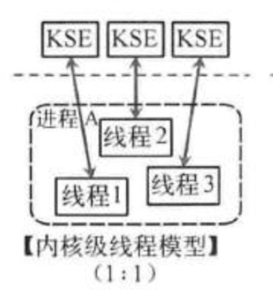
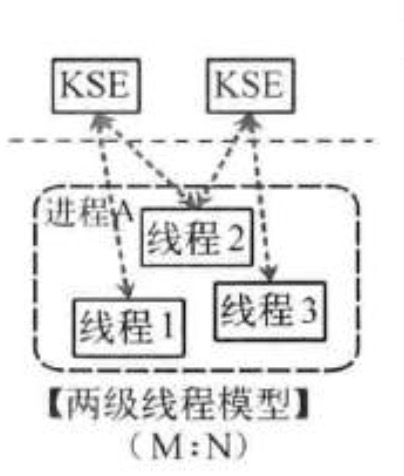

# Go的并发模型

[toc]

## 一、GO并发模型的三要素

### 1.1 操作系统的用户空间和内核空间

参考：[Go goroutine理解](https://segmentfault.com/a/1190000018150987)。

> 我们先从线程讲起，无论语言层面何种并发模型，到了操作系统层面，一定是以线程的形态存在的。而操作系统根据资源访问权限的不同，体系架构可分为用户空间和内核空间；内核空间主要操作访问CPU资源、I/O资源、内存资源等硬件资源，为上层应用程序提供最基本的基础资源，用户空间呢就是上层应用程序的固定活动空间，用户空间不可以直接访问资源，必须通过“系统调用”、“库函数”或“Shell脚本”来调用内核空间提供的资源。
>
> 我们现在的计算机语言，可以狭义的认为是一种“软件”，它们中所谓的“线程”，往往是用户态的线程，和操作系统本身内核态的线程（简称KSE），还是有区别的。

### 1.2 线程模型的实现

参考：[Go goroutine理解](https://segmentfault.com/a/1190000018150987)。

#### （1）用户级线程模型


如图所示，多个用户态的线程对应着一个内核线程，程序线程的创建、终止、切换或者同步等线程工作必须自身来完成。它可以做快速的上下文切换。缺点是不能有效利用多核CPU。

#### （2）内核级线程模型



这种模型直接调用操作系统的内核线程，所有线程的创建、终止、切换、同步等操作，都由内核来完成。一个用户态的线程对应一个系统线程，它可以利用多核机制，但上下文切换需要消耗额外的资源。C++就是这种。

#### （3）两级线程模型



这种模型是介于用户级线程模型和内核级线程模型之间的一种线程模型。这种模型的实现非常复杂，和内核级线程模型类似，一个进程中可以对应多个内核级线程，但是进程中的线程不和内核线程一一对应；这种线程模型会先创建多个内核级线程，然后用自身的用户级线程去对应创建的多个内核级线程，自身的用户级线程需要本身程序去调度，内核级的线程交给操作系统内核去调度。

M个用户线程对应N个系统线程，缺点增加了调度器的实现难度。

Go语言的线程模型就是一种特殊的两级线程模型（GPM调度模型）。

### 1.3 GO线程实现模型MPG

GO的并发模型中有三要素：G（goroutine）、P（processor）、M（machine）。

- M：指代的是系统级线程；一个M直接关联一个内核线程，由操作系统管理。
- G：代表着并发编程模型中的用户级线程；一种轻量级的线程。

- P：指的是一种可以承载如若干个G，且能使这些G适时地与M对接，并得到真正运行的中介；

P的数量由环境变量中的GOMAXPROCS决定，通常来说它是和核心数对应。

## 二、什么是goroutine，它与我们启用的其他goroutine有什么不同

```go
package main

import "fmt"

func main() {
	for i := 0; i < 10; i++ {
		go func() {
			fmt.Println(i)
		}()
	}
}
```

这个源码文件被执行后会打印什么内容？

经典回答：不会打印任何内容。

> 与一个进程总会有一个主线程类似。每一个独立的Go程序在运行时总会有一个主goroutine。这个主goroutine会在go程序的运行准备工作完成后被自动启动，并不需要我们做任何手动的操作。

每条go语句一般都会携带一个函数调用，这个被调用的函数常常被称为**go函数**。

```go
go func() { fmt.Println(i) }()
```

而主goroutine的go函数就是那个作为程序入口的main函数。

（1）启用goroutine

**go函数真正被执行的时间，总会与其所属的go语句被执行的时间不同。** 当程序执行到一条go语句（例如上面的语句，带有go关键字），Go语言的运行时系统，会试图从某个存放空间的G的队列中获取一个G（也就是goroutine），它只有在找不到空闲G的情况下才会去创建一个新的G。

> 创建G的成本非常低。

（2）使用goroutine包装**go函数**

在拿到了空闲的goroutine（简称G）之后，Go语言运行时系统会用这个G去包装当前的那个go函数，然后把这个G追加到某个可运行的G的队列中。

> 等待P，把G对接到M，G才会真正运行。

因此，**go函数**的执行时间总是会明显滞后于它所属的go语句的执行时间。

**go语句（带有go关键字的语句）本身执行完，Go程序完全不会等待go函数的执行，它会立刻去执行后边的语句，这就是所谓的异步并发的执行。**

**一旦主goroutine中的代码（也就是main函数中的那些代码）执行完毕，当前Go程序就会结束运行。**

```go
package main

import "fmt"

func main() {
	for i := 0; i < 10; i++ {
		go func() { fmt.Println(i) }()
	}

	for j := 0; j < 100_0000; j++ {
		_ = j
	}
}
```

上面的程序，让主goroutine多执行一段时间，就发现go函数执行了：

```go
$ go run demo01.go
3
10
10
10
10
10
10
10
10
10
$
```

但打印出来的很多是10。

如果go函数是无参数的匿名函数，那么在它里面的fmt.Println函数的参数只会在go函数被执行的时候才会求值。到那个时候，i的值可能已经是10（最后一个数）了，因为for语句那时候可能已经都执行完毕了。