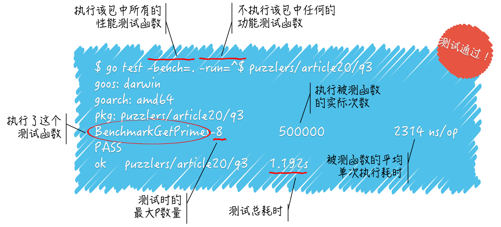
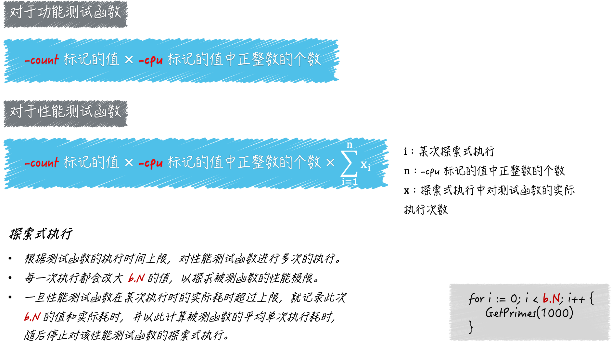

# GO（单元）测试的基本规则和流程

[toc]

## 一、GO程序的三类单元测试

我们可以为Go程序编写三类测试：

- 功能测试（test）
- 基准测试（benchmark，也称性能测试）
- 示例测试（example）

示例测试严格来说是一种功能测试，只不过它更关注程序打印出来的内容。

一个测试源码文件只会针对某个命令源码文件或库源码文件做测试，所以我们总是应该把它们放在同一个代码包内。

测试源码文件的主名称应该以被测源码文件的主名称为前缀，并且以“_test”为后缀。

> 例如，被测源码文件的名称为 demo01.go, 针对它的测试文件的名称应该为demo01_test.go。

每个测试源码文件都必须至少包含一个测试函数。从语法上讲，每个测试文件都可以包含任何一类测试函数。哪怕把三类测试函数都写进去也是可以的。

## 二、GO语言对测试函数的名称和签名的规定

- 对于功能测试函数，其名称必须以**Test为前缀**，并且参数列表只应有一个`*testing.T`类型的参数声明；
- 对于性能测试函数，其名称必须以**Benchmark**为前缀，并且唯一参数的类型必须是`*testing.B`类型的；
- 对于示例测试函数来说，其名称必须以**Example**为前缀，但对函数的参数列表没有强制规定；

## 三、`go test`命令执行的主要测试流程

首先要记住一点，**只有测试源码文件的名称对了，测试函数的名称和签名也对了**，运行`go test`命令的时候，其中的测试代码才有可能被运行。

运行`go test`命令：

- 运行`go test`命令在开始运行时，会先做一些准备工作，比如，确定内部需要哪些命令，检查我们指定的代码包或源码文件的有效性，以及判断我们给予的标识是否合法，等等；
- 在准备工作顺利完成后，`go test`命令就会针对每个被测试代码包，**依次地**进行构建、执行包中符合要求的测试函数。清理临时文件，打印测试结果。

为了加快速度，它通常会并发地对多个被测代码包进行功能测试，只不过，最后打印结果的时候，它会依照我们给定的顺序逐个进行，这会让我们感觉到它是在完全串行地执行测试流程。

另一方面，由于并发的测试会让性能测试对结果存在偏差，所以性能测试多是串行进行的。并且下一个代码包的性能测试总会等到上一个代码性能测试的结果打印完才会开始。并且性能测试函数的执行也都是串行的。

## 四、功能测试的测试结果

### （1）测试成功与结果缓存

看测试命令和结果：

```shell
$ go test article20/q1
ok  	article20/q1	0.415s
$ go test article20/q1
ok  	article20/q1	(cached)
$
```

连续运行两次，发现第二次运行，打印的内容最右边是“(cached)“ 字样。这是表明，由于测试代码和被测试代码都没有任何变动，所以`go test` 命令直接把之前缓存测试成功的结果打印出来了。

**go命令通常会缓存程序构建的结果，以便在将来的构建中重用。**可以通过`go env GOCACHE`命令查看缓存目录的路径。

一旦有任何变动，缓存数据就会失效，go命令就会再次真正的执行操作。

- 可以运行`go clean -cache`命令，手动删除所有的缓存数据。
- 对于测试成功的结果，go命令也会缓存。可以运行`go clean -testcache`命令，删除所有的测试结果缓存。这样做不会删除任何构建结果缓存。
- 设置环境变量GODEBUG的值，也可以稍微改变go命令的缓存行为。比如，设置值为`gocacheverify=1`将会导致go命令绕过任何的缓存数据，而真正地执行操作并重新生成所有结果，然后再去检查新的结果和现有缓存数据是否一致。

### （2） `t.Fail()` 和`t.FailNew()`

```go
func TestFail(t *testing.T) {
	t.Fail()
	// t.FailNow() // 次调用会让当前的测试立刻失效
	t.Log("Fail.")
}
```

添加一个Fail函数，在此运行：

```shell
$ go test article20/q1/
--- FAIL: TestFail (0.00s)
    demo01_test.go:44: Fail.
FAIL
FAIL	article20/q1	0.437s
FAIL
$
```

**对于失败测试的结果，`go test`命令并不会进行缓存。**所以，这种情况，每次都会产生全新的结果。

调用`t.Fail()`，导致测试失败，失败的测试函数中常规函数测试日志中一并打印出来。

上面之所以显示"demo01_test.go:44: Fail." 是因为调用了`t.Log("Fail.")`。

**t.Log和t.Logf方法的作用，就是打印常规的测试日志，只不过测试成功的时候，go test命令就不会打印这类日志了。如果你想在测试结果中看到所有的常规测试日志，那么可以在运行go test 命令的时候加上标记 -v。**

调用`t.FailNow()`会让函数立刻终止执行，之前显示的那句常规日志，也就不会显示了。

```shell
$ go test article20/q1/
--- FAIL: TestFail (0.00s)
FAIL
FAIL	article20/q1	0.426s
FAIL
$
```

### （3）`t.Error` 和`t.Errorf`

```go
func TestError(t *testing.T) {
	t.Error("t.Error 相当于t.Log，再调用 t.Fail")
	t.Errorf("t.Error 相当于%s，再调用 t.Fail", "t.logf")
}
```

###  （4）`t.Fatal` 和 `t.Fatalf`

```go
func TestFatal(t *testing.T) {
	// t.Fatal("t.Error 相当于t.Log，再调用 t.FailNew")
	t.Fatalf("t.Error 相当于%s，再调用 t.FailNew", "t.logf")
}
```

## 五、性能测试的测试结果

看测试命令和结果：

```shell
$ go test -bench=. -run=^$ article20/q2
goos: darwin
goarch: amd64
pkg: article20/q2
cpu: Intel(R) Core(TM) i5-8259U CPU @ 2.30GHz
BenchmarkGetPrimes-8   	  584157	      2067 ns/op
PASS
ok  	article20/q2	2.696s
$
```

- 上面`go test`命令的第一个标记及其值`-bench=.`，只有有了这个标记，命令才会进行性能测试。该标记的`.` 表明执行任何命令的性能测试函数。

  > 当然，函数名称还要符合Go程序测试的基本规则。

- 第二个标记及其值`-run=^$`，表明需要执行哪些功能测试函数。同样也是以函数名称为依据。

  `^$`表明要执行函数名称为空的功能测试函数，换句话说，不执行任何功能测试函数。

- 如果运行`go test`命令的时候不加`-run`标记，那么就会使它执行被测试代码包中的所有功能测试函数。

再看测试结果：

- 倒数第三行"BenchmarkGetPrimes-8   	  584157	      2067 ns/op"。“BenchmarkGetPrimes-8” 是单个性能测试的名称，它表示执行了测试函数”BenchmarkGetPrimes“，并且当时使用的最大P数量为8；

  可以通过`runtime.GOMAXPROCS`函数改变最大P数量，也可以运行`go test`命令时，加上标记`-cpu`来设置一个最大P数量的列表，以供命令在多次测试时使用；

- 在性能测试名称的右边，`go test`命令最后一次执行性能测试函数的时候，被测函数被执行的实际次数。

  ```go
  func BenchmarkGetPrimes(b *testing.B) {
  	// runtime.GOMAXPROCS(5)
  	for i := 0; i < b.N; i++ {
  		GetPrimes(1000)
  	}
  }
  ```

  在一个迭代`b.N`次的循环中调用了`GetPrimes`函数，并给它参数值1000。`go test`命令会尝试先把`b.N`设置为1， 然后执行测试函数。

  如果函数执行的时间没有超过上限，此上限默认为1秒，那么命令会改大`b.N`的值，然后在此执行测试函数。如此反复，直到这个时间大于或等于上限为止。

  当某次执行的时间大于或等于上限时，我们就说这是命令此次对该测试函数的最后一次执行。这时`b.N`的值会被包含在测试结果中。

  我们简称该值为**执行次数**。注意，它是指被测函数的执行次数，而不是性能测试函数的执行次数。

- “2067 ns/op” 表明单次执行`GetPrimes`函数，平均耗时为2067 纳秒。



## 六、如何设置`-cpu`的值，以及对`go test`命令的影响

### （1）设置`-cpu`的作用

`go test`命令中，标记`-cpu`，是用来设置测试执行最大P数量的列表的。

最大P数量代表着GO语言运行时系统同时运行goroutine的能力，也可以视为其中逻辑CPU的最大个数。而`go test`命令的`-cpu`标记正是用于设置这个最大个数的。

默认情况下，最大P的数量等于当前计算机CPU核心的实际数量。

这样，就可以使用`-cpu`标记来模拟：被测试程序在计算能力不同计算机中的表现。

### （2）如何设置`-cpu`的值

标记`-cpu`的值应该是一个正整数的列表，该列表的表现形式为：以英文半角逗号分隔的多个整数字面量，比如1,2,3。

针对此值中的每一个正整数，`go test`命令都会先设置最大P数量为该数，然后再执行测试函数。

如果测试函数有多个，那么`go test`命令会依照此方式逐个执行。

> 以 1,2,4 为例，`go test`命令会先以1,2,4  为最大P数量分别去执行第一个测试函数，之后再用同样的方式执行第二个测试函数，以此类推。

设置的最大 P 数量，最好不要超过当前计算机 CPU 核心的实际数量。因为一旦超出计算机实际的并行处理能力，Go 程序在性能上就无法再得到显著地提升了。

### （3）测试执行流程

go test命令在进行准备工作的时候会读取-cpu标记的值，并把它转换为一个以int为元素类型的切片，我们也可以称它为逻辑 CPU 切片。

如果该命令发现我们并没有追加这个标记，那么就会让逻辑 CPU 切片只包含一个元素值，即最大 P 数量的默认值，也就是当前计算机 CPU 核心的实际数量。

在准备执行某个测试函数的时候，无论该函数是功能测试函数，还是性能测试函数，go test命令都会迭代逻辑 CPU 切片，并且在每次迭代时，先依据当前的元素值设置最大 P 数量，然后再去执行测试函数。

### （4）标记`-count`

`-count`标记是专门用于重复执行测试函数的。它的值必须大于或等于0，并且默认值为1。

> 如果我们在运行go test命令的时候追加了-count 5，那么对于每一个测试函数，命令都会在预设的不同条件下（比如不同的最大 P 数量下）分别重复执行五次。

### （5）测试函数实际执行次数

> 性能测试函数的执行次数 = `-cpu`标记的值中正整数的个数 x `-count`标记的值 x 探索式执行中测试函数的实际执行次数

> 功能测试函数的执行次数 = `-cpu`标记的值中正整数的个数 x `-count`标记的值



```shell
$ go test -cpu=2,4 -count=2 -bench=.* -run=^$ article20/q2
goos: darwin
goarch: amd64
pkg: article20/q2
cpu: Intel(R) Core(TM) i5-8259U CPU @ 2.30GHz
BenchmarkGetPrimesWith100-2       	 5069271	       230.4 ns/op
BenchmarkGetPrimesWith100-2       	 5056988	       235.0 ns/op
BenchmarkGetPrimesWith100-4       	 4881969	       237.8 ns/op
BenchmarkGetPrimesWith100-4       	 5021985	       238.4 ns/op
BenchmarkGetPrimesWith10000-2     	   40132	     29106 ns/op
BenchmarkGetPrimesWith10000-2     	   38778	     29269 ns/op
BenchmarkGetPrimesWith10000-4     	   39919	     29303 ns/op
BenchmarkGetPrimesWith10000-4     	   39756	     29618 ns/op
BenchmarkGetPrimesWith1000000-2   	     308	   3906910 ns/op
BenchmarkGetPrimesWith1000000-2   	     306	   3842012 ns/op
BenchmarkGetPrimesWith1000000-4   	     303	   3875903 ns/op
BenchmarkGetPrimesWith1000000-4   	     309	   3829546 ns/op
PASS
ok  	article20/q2	18.036s
$
```

## 七、`-parallel`标记的作用

在运行`go test`命令的时候，可以追加标记`-parallel`，该标记的作用是：设置同一个被测试代码包中的功能测试函数的最大并发执行数。该标记的默认值是测试运行的最大P数量。（这可以通过调用表达式`runtime.GOMAXPROCS(0)`获得）

在默认情况下，对于同一个被测代码包中的多个功能测试函数，命令会串行地执行它们。除非我们在一些功能测试函数中显式地调用t.Parallel方法。

这个时候，这些包含了t.Parallel方法调用的功能测试函数就会被go test命令并发地执行，而并发执行的最大数量正是由-parallel标记值决定的。不过要注意，同一个功能测试函数的多次执行之间一定是串行的。

**`-parallel`标记对性能测试是无效的**

## 八、性能测试函数中的计数器

testing.B类型有这么几个指针方法：StartTimer、StopTimer和ResetTimer。这些方法都是用于操作当前的性能测试函数专属的计时器的。

所谓的计时器，是一个逻辑上的概念，它其实是testing.B类型中一些字段的统称。这些字段用于记录：当前测试函数在当次执行过程中耗费的时间、分配的堆内存的字节数以及分配次数。

**在性能测试函数中，我们可以通过对b.StartTimer和b.StopTimer方法的联合运用，再去除掉任何一段代码的执行时间。**

```go

func BenchmarkGetPrimes(b *testing.B) {
 b.StopTimer()
 time.Sleep(time.Millisecond * 500) // 模拟某个耗时但与被测程序关系不大的操作。
 max := 10000
 b.StartTimer()

 for i := 0; i < b.N; i++ {
  GetPrimes(max)
 }

```

b.ResetTimer方法的灵活性就要差一些了，它只能用于：去除在调用它之前那些代码的执行时间。不过，无论在调用它的时候，计时器是不是正在运行，它都可以起作用。

## 九、参考

[go命令文档中的测试标记](https://golang.google.cn/cmd/go/#hdr-Testing_flags)。

