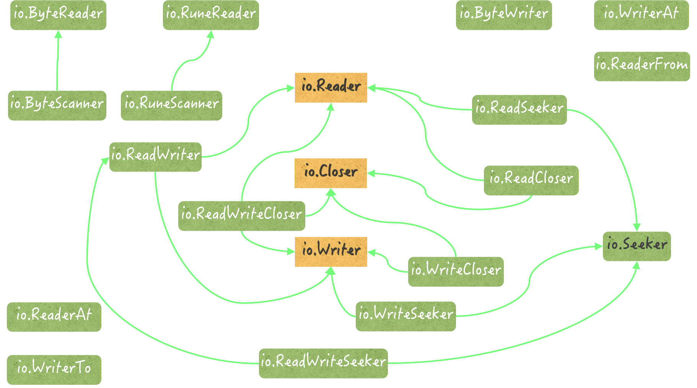

# GO的IO接口和工具

[toc]

## 一、io包中接口的好处和优势

### 1.1拷贝数据的函数

- `io.Copy(dst Writer, src Reader)`
- `io.CopyBuffer(dst Writer, src Reader, buf []byte)`
- `io.CopyN(dst Writer, src Reader, buf []byte)`

```go
	src := strings.NewReader(
		"CopyN copies n bytes (or unil an error) from src to dst." +
			"It returns the number of bytes copied and " +
			"the earliest error encountered while copying")
	dst := new(strings.Builder)
	written, err := io.CopyN(dst, src, 58)
	if err != nil {
		fmt.Printf("err: %v\n", err)
	} else {
		// Written(58): "CopyN copies n bytes (or unil an error) from src to dst.It"
		fmt.Printf("Written(%d): %q\n", written, dst.String())
	}
```

## 二、 在io包中，io.Reader 的扩展接口和实现类型都有哪些

### 2.1 `io.Reader`的扩展接口

1. `io.ReadWriter` 这个接口即是`io.Reader`的扩展接口，也是`io.Writer`的扩展接口；

   该接口定义了一组行为，包含且仅包含了基本的字节序列读取方法Read，和字节写入方法Write。

2. `io.ReadCloser`： 该接口除了包含基本的字节序列读取方法以外，还拥有一个基本的关闭方法Close。

   Close方法一般用于关闭数据读写的通道。这个接口其实是`io.Reader`接口和`io.Closer`接口的组合。

3. `io.ReadWriteCloser`：这个接口是`io.Reader`、`io.Writer`、`io.Closer`三个接口的组合。

4. `io.ReadSeeker` ：该接口拥有一个寻找读写位置的基本方法Seek。

   该方法可以根据给定的偏移量，基于数据的起始位置、末尾位置、或者当前读写位置去寻找新的读写位置。这个新的读写位置用于表明下一次读或写时的起始索引。

   Seek是`io.Seeker`接口唯一拥有的方法。

5. `io.ReadWriteSeeker`：这个接口是`io.Reader`、`io.Writer`、`io.Seeker`三个接口的组合。

### 2.2 `io.Reader`接口的实现类型

1. `*io.LimitedReader`：此类型的基本类型会包装`io.Reader`类型的值，并提供一个额外的受限读取的功能。

   该类型的读取方法Read返回的总数据量会受到限制。无论该方法被调用多少次。这个限制由该类型的字段N指明，单位是字节。

2. `*io.SectionReader` ：此类型的基本类型可以包装`io.ReaderAt`类型的值，并且会限制它的Read方法，只能读取原始数据的一部分（或者说某一段）。

   这个数据段段起始位置和末尾位置，需要在它被初始化的时候就指明，并且之后无法变更。该类型的值的行为与切片有些类型，只会对外暴露在其窗口之中的那些数据。

3. `*io.teeReader`：该类型是一个包级私有的数据类型，也是`io.TeeReader`函数结果值的实际类型。

   `TeeReader(r Reader, w Writer)`函数的结果值的Read方法，会把r中的数据经过作为方法参数的字节切片p写入w中。也就是说，p是r和w的数据搬运工。

   ```go
   	teeReader1 := io.TeeReader(src, dst)
   	p := make([]byte, 7)
   	teeReader1.Read(p)
   ```

4. `*io.multiReader`：该类型也是包级私有的数据类型。类似地，io包中有一个名为MultiReader的函数，它可以接受若干个io.Reader类型的参数值，并返回一个实际类型为`io.multiReader`的结果值。

   当这个结果值当Read方法被调用，它会顺序地从前面那些io.Reader类型的参数值中读取数据。因此，我们也称之为多对象读取器。

5. `*io.pipe`：此类型是一个包级私有的数据类型。它不但实现了`io.Reader`接口，而且还实现了`io.Writer`接口。

   实际上，`io.PipeReader`类型和`io.PipeWriter`类型拥有的所有指针方法都是以它为基础的。这些方法都是代理了`io.pipe`类型值所拥有的某一个方法而已。

   `Pipe() (*PipeReader, *PipeWriter) ` 返回两个类型的指针值，并分别把它们作为其生成的同步内存管道的两端。所以可以说，`*io.pipe`类型就是io包提供的同步内存管道的核心实现。

6. `*ip.PipeReader`该类型可以被视为`*io.pipe`类型的代理类型。它代理了后者的一部分功能，并基于后者实现了`io.ReadClosed`接口。同时，它还定义了同步内存管道的读取端。

> 在实际的面试中，只要应聘者能够从某一个方面出发，说出io.Reader的扩展接口及其存在意义，或者说清楚该接口的三五个实现类型，那么就可以算是基本回答正确了。

### 2.3 示例

```go
package main

import (
	"fmt"
	"io"
	"strings"
	"sync"
	"time"
)

func executeIfNoErr(err error, f func()) {
	if err != nil {
		fmt.Printf("error: %v\n", err)
		return
	}
	f()
}

func example1(comment string) {
	// 创建一个字符串
	// 创建一个字符串读取器，它的名字是 reader1。
	fmt.Println("创建一个字符串读取器，它的名字是 reader1。")
	reader1 := strings.NewReader(comment)
	buf1 := make([]byte, 7)
	n, err := reader1.Read(buf1)
	var index1, offset1 int64
	executeIfNoErr(err, func() {
		// Read(7): "Package"
		fmt.Printf("Read(%d): %q\n", n, buf1[:n])
		offset1 = int64(54)
		index1, err = reader1.Seek(offset1, io.SeekCurrent)
	})
	executeIfNoErr(err, func() {
		fmt.Printf("基于当前的所以，移动%d的偏移量后，新的索引值为: %d \n", offset1, index1)
		n, err = reader1.Read(buf1)
	})
	executeIfNoErr(err, func() {
		fmt.Printf("Read(%d):%q\n", n, buf1[:n])
	})
	fmt.Println()
}

func example2(comment string) {
	reader1 := strings.NewReader(comment)
	reader1.Reset(comment)
	num := int64(7)
	fmt.Printf("创建一个新的限制Reader，限制读的数量为：%d\n", num)
	reader2 := io.LimitReader(reader1, num)
	buf2 := make([]byte, 10)
	for i := 0; i < 3; i++ {
		n, err := reader2.Read(buf2)
		executeIfNoErr(err, func() {
			fmt.Printf("Read(%d):%q\n", n, buf2[:n])
		})
	}
	fmt.Println()
}

func example3(comment string) {
	reader1 := strings.NewReader(comment)
	writer1 := new(strings.Builder)
	fmt.Println("创建一个新的teeReader， 带有一个reader和一个writer")
	reader3 := io.TeeReader(reader1, writer1)
	buf4 := make([]byte, 40)
	for i := 0; i < 8; i++ {
		n, err := reader3.Read(buf4)
		executeIfNoErr(err, func() {
			fmt.Printf("Read(%d):%q\n", n, buf4[:n])
		})
	}
	fmt.Println()
}

func example4(comment string) {
	reader1 := strings.NewReader(comment)
	offset1 := int64(56)
	num2 := int64(72)
	fmt.Printf("创建一个section Reader 带有一个Reader， 偏移量为%d, 数量为 %d...\n", offset1, num2)
	reader2 := io.NewSectionReader(reader1, offset1, num2)
	buf1 := make([]byte, 20)
	for i := 0; i < 5; i++ {
		n, err := reader2.Read(buf1)
		executeIfNoErr(err, func() {
			fmt.Printf("Read(%d): %q\n", n, buf1[:n])
		})
	}
	fmt.Println()
}

func example5() {
	reader01 := strings.NewReader("MultiReader returns a Reader that's the logical concatenation of " +
		"the provided input readers.")
	reader02 := strings.NewReader("They're read sequentially.")
	reader03 := strings.NewReader("Once all inputs have returned EOF, " +
		"Read will return EOF.")
	reader04 := strings.NewReader("If any of the readers return a non-nil, " +
		"non-EOF error, Read will return that error.")
	fmt.Println("创建一个multi-reader， 带有4个reader")
	reader1 := io.MultiReader(reader01, reader02, reader03, reader04)
	buf2 := make([]byte, 50)
	for i := 0; i < 8; i++ {
		n, err := reader1.Read(buf2)
		executeIfNoErr(err, func() {
			fmt.Printf("Read(%d): %q\n", n, buf2[:n])
		})
	}
	fmt.Println()
}

func example6() {
	fmt.Println("创建一个新的内存同步管道....")
	pipeReader, pipWriter := io.Pipe()
	_ = interface{}(pipeReader).(io.ReadCloser)
	_ = interface{}(pipWriter).(io.WriteCloser)
	comments := [][]byte{
		[]byte("Pipe creates a synchronous in-memory pipe."),
		[]byte("It can be used to connect code expecting an io.Reader "),
		[]byte("with code expecting an io.Writer."),
	}
	// 这里的同步工具，纯属为了保证下面示例中的打印语句能够执行完成
	// 在实际中没必要这样做
	var wg sync.WaitGroup
	wg.Add(2)
	go func() {
		defer wg.Done()
		for _, d := range comments {
			time.Sleep(time.Millisecond * 500)
			n, err := pipWriter.Write(d)
			if err != nil {
				fmt.Printf("read error : %v\n", err)
				break
			}
			fmt.Printf("Writen(%d): %q\n", n, d)
		}
		pipWriter.Close()
	}()
	go func() {
		defer wg.Done()
		wBuf := make([]byte, 55)
		for {
			n, err := pipeReader.Read(wBuf)
			if err != nil {
				fmt.Printf("read error: %v\n", err)
				break
			}
			fmt.Printf("Read(%d): %q\n", n, wBuf[:n])
		}
	}()
	wg.Wait()
}

func main() {
	comment := "Package io provides basic interfaces to I/O primitives. " +
		"Its primary job is to wrap existing implementations of such primitives, " +
		"such as those in package os, " +
		"into shared public interfaces that abstract the functionality, " +
		"plus some other related primitives."
	// 示例1:: Seek
	example1(comment)
	// 示例2: LimitReader
	example2(comment)
	// 示例3: TeeReader
	example3(comment)
	// 示例4: NewSectionReader
	example4(comment)
	// 示例5: MultiReader
	example5()
	// 示例6
	example6()
}

```

## 三、io包的接口，以及它们之间的关系

没有嵌入其它接口并且只定义了一个方法的接口，总共有11个。其中有3个接口有着众多的扩展接口和实现类型，它们是：`io.Reader`、`io.Writer`、`io.Closer`。

可以把这些接口分为四类：读取、写入、关闭、读写位置设定。前三个操作属于基本的I/O操作。

### 3.1 读操作接口

上面已经讨论，核心接口`io.Reader`有5个扩展接口，6个实现类型。更多的读操作接口还有：

- `io.ByteReader`和`io.RuneReader`。它们分别定义了一个读取方法：`ReadByte`和`ReadRune`。用于读取下一个单一的字节和Unicode字符。

  ```go
  	var b *bytes.Buffer
  	b = bytes.NewBufferString("ab")
  	_ = interface{}(b).(io.ByteReader)
  	_ = interface{}(b).(io.RuneReader)
  	_ = interface{}(b).(io.ByteScanner)
  	_ = interface{}(b).(io.RuneScanner)
  	// io.ByteReader
  	var reader01 *strings.Reader
  	reader01 = strings.NewReader("aa")
  	_ = interface{}(reader01).(io.ByteReader)
  	_ = interface{}(reader01).(io.RuneReader)
  	_ = interface{}(reader01).(io.ByteScanner)
  	_ = interface{}(reader01).(io.RuneScanner)
  ```

  `strings.Reader`和`bytes.Buffer`都是`io.ByteReader`和`io.RuneReader`的实现类型。同时，这两个接口，还都实现了`io.ByteScanner`和 `io.RuneScanner`。

  ```go
  type ByteScanner interface {
  	ByteReader
  	UnreadByte() error
  }
  ```

  `io.ByteScanner`接口内嵌了简单接口`io.ByteReader`、并额外定义了`UnreadByte`方法，这样，它就抽象出一个能够读取和读回退单字节的功能集。

  ```go
  type RuneScanner interface {
  	RuneReader
  	UnreadRune() error
  }
  ```

  `io.RuneScanner`接口内嵌了简单接口`io.RunneReader`，并额外定义了`UnreadRune`方法。这样，它就抽象出一个能够读取和读回退单个Unicode字符的功能集。

- `io.ReaderAt`接口只定义了一个方法ReadAt。ReadAt是一个纯粹的只读方法。

  它只读其所属值中包含的字节，而不对这个值进行真正的修改。比如，它绝对不能修改已读计数的值。

- `io.WriterTo`接口，定义了一个名为`WriteTo`的方法。它只会接受一个`io.Writer`类型的参数值，并从该参数值中读出数据，并写入其所属值中。

  与之对应的接口是`io.ReaderFrom`

- `io.CopyN`函数，在复制数据的时候，会检查其参数src，是否实现了`io.WriterTo`接口。如果是，那么它就直接利用该值的`WriteTo`方法，把其中的数据拷贝给参数dst参数的值。

  类似地，这个函数还会检查dst的值是否实现了io.ReaderFrom接口。如果是，那么它就会利用这个值的ReadFrom方法，直接从src那里把数据拷贝到该值。

- `io.Copy`和`io.CopyBuffer`，和`io.CopyN`一样。因为它们内部复制到时候，使用同一套代码。

### 3.2 写操作接口

- `io.ReaderFrom`接口，它定义了一个名叫`ReadFrom`的写入方法。该方法接受一个`io.Reader`类型的参数值。并会从该参数值中读取数据，并写入到所属值中。

基于`io.Writer` 扩展的接口

- `io.ReadWriter`

  `*io.pipe`就是`io.ReadWriter` 接口的实现类型。

- `io.ReadWriteClose`

- `io.ReadWriteSeeker`

- `io.WriteCloser`

- `io.WriteSeeker`

- `io.ByteWriter`

- `io.WriterAt`

`*io.File`不但是`io.WriterAt`的实现类型，同时还实现了`io.ReadWriterCloser`、`io.ReadWriteSeeker`接口。

### 3.3 读写位置设定接口

- `io.Seeker`接口作为一个读写位置设定相关的接口，仅定义了一个方法，叫`Seek`。

基于`io.Seeker`扩展的接口：

- `io.ReadSeeker`

- `io.ReadWriteSeeker`

- `io.WriteSeeker`

  `io.WriteSeeker`是基于`io.Writer`和`io.Seeker`的扩展接口

`*strings.Reader`和`*io.SectionReader`都实现了`io.Seeker`接口，这两个类型也都是`io.ReaderAt`接口的实现类型。

```go
	var reader02 *strings.Reader
	reader02 = strings.NewReader("aa")
	_ = interface{}(reader02).(io.Seeker)
	_ = interface{}(reader02).(io.ReaderAt)
	var sectionReader01 *io.SectionReader
	sectionReader01 = io.NewSectionReader(reader02, 0, 1)
	_ = interface{}(sectionReader01).(io.Seeker)
	_ = interface{}(sectionReader01).(io.ReaderAt)
```

### 3.4 关闭操作

- `io.Closer`

它的实现类型，在io包里只有`io.PipeReader`和`io.PipeWriter`。

## 四、总结11个简单接口和9个扩展接口

### 4.1 读取操作接口有5个

- **`io.Reader`**
- `io.ByteReader`

- `io.RuneReader`
- `io.ReaderAt`
- `io.WriterTo`

### 4.2 写入操作接口有4个

- **`io.Writer`**
- `io.ByteWriter`
- `io.WriterAt`
- `io.ReaderFrom`

### 4.3 关闭操作接口有1个

- **`io.Closer`**

### 4.4 读写位置设定的接口有1个

- **`io.Seeker`**

### 4.5 基于11简单接口的扩展接口有9个

- `io.ReadWriter` 
- `io.ReadCloser`
- `io.ReadSeeker` 
- `io.ByteScanner`
- `io.RuneScanner`
- `io.ReadWriteCloser`
- `io.ReadWriteSeeker`
- `io.WriteCloser`
- `io.WriteSeeker`



